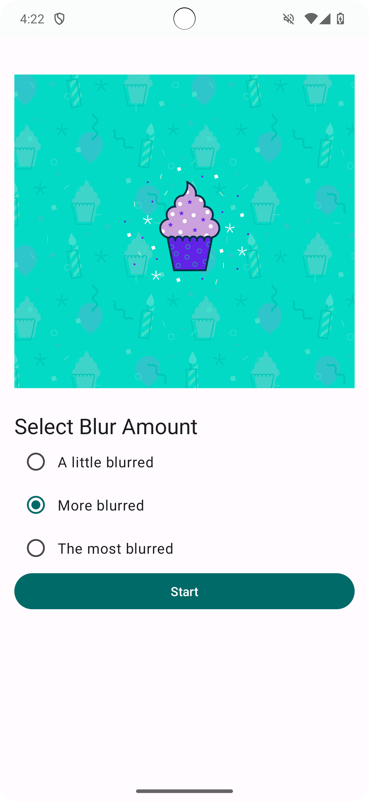
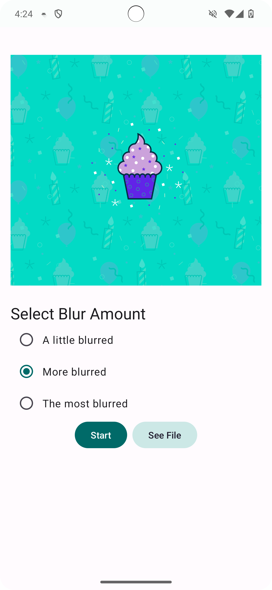
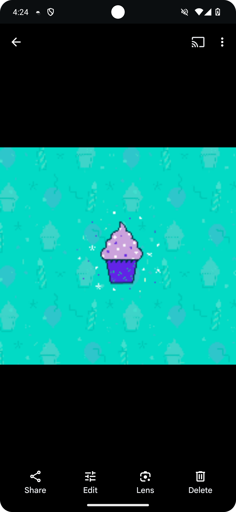

Blur-O-Matic App
===================================

At I/O 2018, Google announced [Android Jetpack](https://developer.android.com/jetpack/), a collection of libraries, tools, and architectural guidance to accelerate and simplify the development of great Android apps. One of those libraries is the [WorkManager library](https://developer.android.com/topic/libraries/architecture/workmanager/). The WorkManager library provides a unified API for deferrable one-off or recurring background tasks that need guaranteed execution.

It's developed using Jetpack Compose components like ```Column```, ```Button```, ```Text```, ```Image```, and ```Modifier```.

<p align="center">
  
  
  
  
  
  
</p>

Getting Started
---------------

1. [Install Android Studio](https://developer.android.com/studio/install.html), if you don't already have it.
2. Download the sample.
3. Import the sample into Android Studio.
4. Build and run the sample.

Notes:
- The application code contains a battery not low constraint. If the device/emulator has a low battery, the application will appear to hang until this constraint is met.

- The app requires notifications to be enabled. To enable notifications, navigate to the Android Settings menu > Apps > Blur-O-Matic > Notifications > Enable "All Blur-O-Matic notifications".
